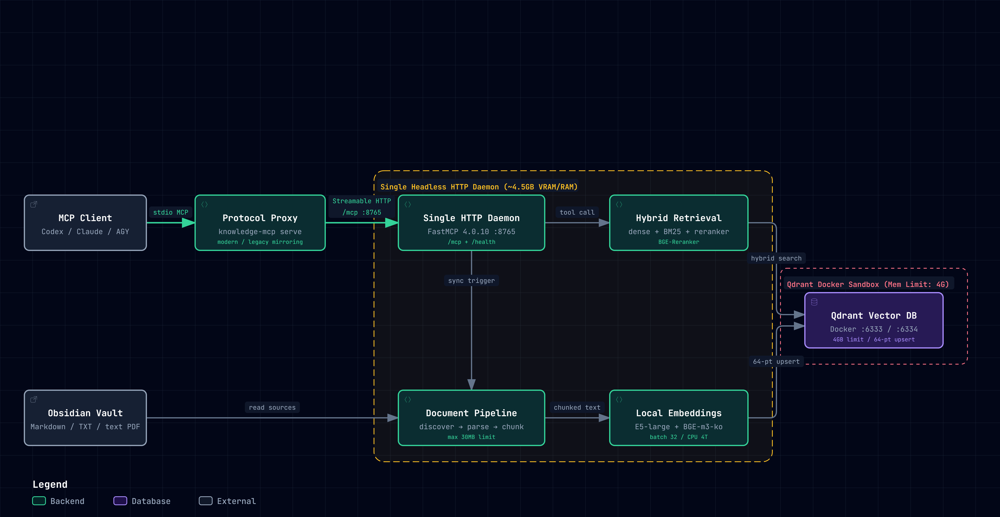

# Obsidian Knowledge MCP

[](https://www.python.org/)
[](LICENSE)
[](https://github.com/PrefectHQ/fastmcp)
[](https://qdrant.tech/)

A **local-first, privacy-preserving Model Context Protocol (MCP) server** designed for personal Obsidian Vaults. It provides hybrid dense/sparse retrieval with Korean-optimized re-ranking across Markdown, TXT, and text-extractable PDFs without sending a single byte of your personal notes to third-party cloud APIs.

---

## 1. Why This Project? (Engineering Background & Design Decisions)

### 1.1 Zero Cloud Leakage: Absolute Local Privacy
Personal notes in Obsidian frequently contain private journals, research drafts, financial thoughts, or credentials. Relying on cloud-based vector databases or third-party embedding APIs introduces unavoidable privacy risks.
- **100% On-Device**: Embeddings (`BGE-m3-ko`), cross-encoder re-ranking, and vector search (native `Qdrant` or an existing local service) execute entirely on your local machine.
- **No External Telemetry**: No telemetry or query tracking leaves your computer.

### 1.2 Multi-Agent Resource Contention & System Freezing
In a modern development setup, multiple AI agents (e.g., **Codex**, **Claude Code**, and **Antigravity**) often run simultaneously. Under the standard MCP `stdio` model, each client launched its own Python worker process:
- **Duplicate Model Loading**: Each worker loaded both `multilingual-e5-large` (~2.2GB) and `BGE-m3-ko` (~2.2GB) into memory. Spawning 3 clients instantly consumed **over 13.5GB+ of RAM**.
- **VRAM Depletion & OS Freezing**: Running heavy neural models simultaneously exceeded the 12GB VRAM limit on consumer GPUs (such as the RTX 4070 Ti). Windows Display Driver Model (WDDM) responded by paging excess VRAM over the PCIe bus into system RAM, saturating the bus and causing Desktop Window Manager (`dwm.exe`) freezes and mouse lockups.
- **CPU Starvation**: Uncapped PyTorch / ONNX threads commandeered 100% of all logical CPU cores during tokenization.

### 1.3 The Solution: Single HTTP Daemon + Lightweight Stdio Protocol Proxy
To permanently solve these resource bottlenecks, the architecture was restructured:
1. **Single HTTP Daemon**: A dedicated background service (`FastMCP 4.0.10`, MCP SDK `2.2.0`) hosts exactly **one** shared copy of the embedding and re-ranking models (~4.6GB total). It serves Streamable HTTP at `http://127.0.0.1:8765/mcp` and process health at `/health`.
2. **Lightweight Stdio Protocol Proxy**: AI clients launch `knowledge-mcp serve` without importing heavy ML libraries. The official FastMCP proxy mirrors the client's protocol era: modern clients use MCP `2026-07-28` on both sides, while legacy clients retain normal initialize-based negotiation. Modern `server/discover` requests are supported without a forced legacy fallback.
3. **5-Layer Resource Guardrails**:
   - **CPU Thread Clamping**: PyTorch inference defaults to 4 threads, clamped to the available CPU count. This controls inference parallelism; CPU utilization can still spike.
   - **Batched Inferences**: SentenceTransformer embedding and cross-encoder reranking default to batch 8. Native model inference is serialized across providers, including the retained FastEmbed provider.
   - **Chunked Qdrant Upserts**: Points are upserted in batches of 64 to bound each Qdrant request.
   - **File Size Ceiling**: Files over 30MB are automatically skipped to protect parser memory.
   - **Docker Rollback Limit**: The optional Docker container retains its 4GB Compose limit; this limit does not apply to native Qdrant.

The default BGE embedding and reranker use SentenceTransformer/PyTorch. Configure `KNOWLEDGE_EMBEDDING_BATCH_SIZE` and `KNOWLEDGE_RERANKER_BATCH_SIZE` (1–256), and `KNOWLEDGE_CPU_THREADS` (positive integer, clamped to the host CPU count). Batch 8 was selected from isolated cached-model CUDA measurements using synthetic inputs: compared with batch 32, embedding peak allocated memory fell by about 273 MiB and reranking by about 286 MiB, with nearly equal elapsed time for that sample. Batch 4 yielded smaller additional memory savings and slower processing. These measurements do not predict total system GPU memory or every workload's latency; see the [measurement record](docs/2026-10-01-qdrant-hardening-results.md).

`KNOWLEDGE_CUDA_MEMORY_FRACTION` is optional and must be greater than 0 and at most 1. It configures PyTorch's process CUDA allocator budget before model loading; unset preserves PyTorch's default. The fraction covers allocator-managed memory, not total VRAM: CUDA context, other allocations and other processes remain outside it. A budget too small for the models or a batch can cause an allocation failure. CPU threads and the GPU allocator budget are process settings. Restart the daemon after changing them. Resource settings preserve model precision, token length and vector normalization, and changing only these settings does not require reindexing.

The retained `LocalFastEmbedProvider` exposes separate ONNX controls: `KNOWLEDGE_ONNX_GPU_MEM_LIMIT` (positive bytes, optional), `KNOWLEDGE_ONNX_ARENA_EXTEND_STRATEGY` (`kSameAsRequested`, the default, or `kNextPowerOfTwo`), and `KNOWLEDGE_ONNX_INTRA_OP_NUM_THREADS` (positive integer, default 4, clamped to the host CPU count). They reach ONNX Runtime's actual session/provider creation. `gpu_mem_limit` limits only the CUDA execution provider's arena and cannot cap total GPU memory. FastEmbed falls back to the CPU provider when CUDA initialization fails. These options apply only when constructing the retained FastEmbed provider; the supported default BGE model and CLI use PyTorch, and no ONNX model is added to the supported model list.

### 1.4 Hybrid Retrieval + Cross-Encoder Re-ranking
- **Dense Vector Search**: Powered by `dragonkue/BGE-m3-ko` (1024 dimensions) for deep semantic matching.
- **Sparse BM25 Index**: Built directly inside Qdrant to capture exact technical terms, symbols, and code identifiers.
- **Reciprocal Rank Fusion (RRF)**: Merges dense and sparse candidates into a unified rank.
- **Cross-Encoder Re-ranking**: Second-stage re-ranking defaults to enabled via `dragonkue/bge-reranker-v2-m3-ko`, using CUDA when available and CPU when CUDA is unavailable or initialization fails.

---

## 2. Architecture

<p align="center">
  <a href="docs/obsidian-knowledge-architecture.html">
    <picture>
      <source media="(prefers-color-scheme: dark)" srcset="docs/architecture-dark.png">
      <source media="(prefers-color-scheme: light)" srcset="docs/architecture-light.png">
      
    </picture>
  </a>
</p>

<p align="center">
  <em>💡 Click the diagram above to open the <strong><a href="docs/obsidian-knowledge-architecture.html">Interactive Architecture Diagram (HTML)</a></strong> in your browser (supports zoom/pan, route inspection, and node search).</em>
</p>

<details>
<summary><b>View Text-based ASCII Diagram</b></summary>

```text
[ Obsidian Vault Files ] (.md, .txt, .pdf)
         │
         ▼
[ AI MCP Clients ] (Codex, Claude Code, Antigravity)
         │  (stdio)
         ▼
[ Stdio Protocol Proxy ]  <-- Official FastMCP proxy per client; era mirroring
         │  (Streamable HTTP: http://127.0.0.1:8765/mcp)
         ▼
[ Single HTTP Daemon (Port 8765, /health) ]
   ├── BGE-m3-ko Embedding Model (GPU / CUDA)
   ├── bge-reranker-v2-m3-ko (CUDA/CPU Warmup)
   └── FastMCP Tools: qdrant-find, knowledge-index-status, knowledge-index-sync
         │
         ├──> [ Local Qdrant 1.19.1 ] (Port 6333 / 6334)
         │       └── Dense vectors, BM25 index, text chunks & payloads
         │
         └──> [ SQLite State ] (Project/.knowledge/state.sqlite3)
                 └── File sync manifests, generation logs, bounded query metrics
```
</details>

Streamable HTTP uses one `/mcp` endpoint with POST requests and JSON or request-scoped SSE responses. Those SSE responses are distinct from the retired HTTP+SSE transport's persistent `/sse` connection and separate message endpoint. Modern requests use discovery and per-request protocol metadata without requiring `initialize`, a protocol session ID, or a separate GET stream. Direct HTTP, the default stdio proxy, and `serve --standalone` support MCP `2026-07-28`; standalone loads its own models and exposes the two read tools (`qdrant-find`, `knowledge-index-status`).

---

## 3. Installation & Prerequisites

### 3.1 Prerequisites
- **Python**: 3.11 or higher
- **Qdrant 1.19.1**: Official native executable; Docker Desktop is optional for rollback.
- **NVIDIA GPU** (Recommended): CUDA 12.x compatible GPU for fast embedding inference (falls back to CPU if unavailable).

### 3.2 Setup Steps

1. **Clone the repository**:
   ```bash
   git clone https://github.com/GooDongWoo/obsidian-knowledge-mcp.git
   cd obsidian-knowledge-mcp
   ```

2. **Create and activate a virtual environment**:
   ```powershell
   # Windows PowerShell
   python -m venv .venv
   .\.venv\Scripts\Activate.ps1
   ```

3. **Install PyTorch with CUDA support** (Optional, for GPU acceleration):
   ```powershell
   python -m pip install torch==2.11.0+cu128 --index-url https://download.pytorch.org/whl/cu128
   ```

4. **Install dependencies**:
   ```powershell
   python -m pip install -e .
   python -m pip check
   ```
   To reproduce the Windows Python 3.13 CUDA environment, install the CUDA PyTorch build above first, then use `python -m pip install -c constraints/fastmcp4-windows-py313.txt -e '.[dev]'`. This constraints file describes that environment; it is not a cross-platform lockfile. FastMCP is pinned to `4.0.10` and the MCP SDK to `2.2.0`.

   Verify GPU availability:
   ```powershell
   python -c "import torch; print('CUDA Available:', torch.cuda.is_available())"
   ```

The `qdrant-mcp` extra has been removed: its old `mcp-server-qdrant==0.8.1` dependency pins FastMCP `2.7.0` and Pydantic `<2.12.0`. If you need that separate server, keep it in a separate FastMCP 2 environment.

For an existing installation, create a fresh `.venv` in a separate checkout/worktree. Retain the original checkout, editable environment, and client settings for rollback; do not upgrade the original environment in place or copy a virtual environment. The migration changes transport and protocol, with no required collection rebuild, model change, or SQLite/Qdrant format change.

---

## 4. Quick Start

### 4.1 Set Environment Variables
Set the paths to your Obsidian Vault and this project repository:
```powershell
$env:KNOWLEDGE_VAULT_ROOT = "C:\Path\To\Your\Obsidian"
$env:KNOWLEDGE_PROJECT_ROOT = "C:\Path\To\obsidian-knowledge-mcp"
```

The project `.env` is loaded before FastMCP imports. Keep the daemon bound to localhost and use these defaults from `.env.example`:

```dotenv
FASTMCP_CHECK_FOR_UPDATES=off
FASTMCP_TELEMETRY_MODE=off
FASTMCP_SHOW_SERVER_BANNER=false
FASTMCP_DEPRECATION_WARNINGS=true
```

No global OpenTelemetry exporter is configured by this project. SDK tracing dependencies alone do not imply remote export; embedding and search remain local.

### 4.2 Initial Indexing
Configure the official Qdrant 1.19.1 executable, then execute the initial index:
```powershell
$env:KNOWLEDGE_QDRANT_EXECUTABLE = "C:/Tools/qdrant-1.19.1/qdrant.exe"
.\.venv\Scripts\knowledge-mcp.exe index
```
- A healthy localhost Qdrant is reused. Otherwise the launcher starts the configured native executable (or `qdrant` on PATH), bound to 127.0.0.1. Services should use the absolute executable path.
- Native data defaults to `%USERPROFILE%/.knowledge-qdrant/<project-path-hash>`; set `KNOWLEDGE_QDRANT_NATIVE_STORAGE` to a short absolute path if needed. Existing nonempty directories without the native ownership marker are refused.
- Existing Docker data remains under `KNOWLEDGE_QDRANT_STORAGE` (default `.knowledge/qdrant`). Select `KNOWLEDGE_QDRANT_BACKEND=docker` explicitly for rollback. An existing installation needs a snapshot restore into new native storage before cutover; see the [migration and optional Windows service procedure](docs/qdrant-status-and-diagnostics.md#native-qdrant-migration).
- The first run downloads the embedding model and builds the initial index. Subsequent runs are fully incremental.

### 4.3 Background Daemon Management
Manage the shared background daemon using the `daemon` subcommands:
```powershell
# Start the background daemon
.\.venv\Scripts\knowledge-mcp.exe daemon start

# Check status and PID
.\.venv\Scripts\knowledge-mcp.exe daemon status

# Stop the daemon (unloads models from memory)
.\.venv\Scripts\knowledge-mcp.exe daemon stop
```

---

## 5. MCP Client Configuration

Register the server with your favorite AI coding assistants.

### 5.1 OpenAI Codex (`~/.codex/config.toml`)
```toml
[mcp_servers.obsidian_knowledge]
command = "C:\\Path\\To\\obsidian-knowledge-mcp\\.venv\\Scripts\\knowledge-mcp.exe"
args = ["serve", "--client", "codex"]
env = { KNOWLEDGE_VAULT_ROOT = "C:\\Path\\To\\Your\\Obsidian", KNOWLEDGE_PROJECT_ROOT = "C:\\Path\\To\\obsidian-knowledge-mcp" }
startup_timeout_sec = 900
```

### 5.2 Claude Code (`claude_desktop_config.json`)
```json
{
  "mcpServers": {
    "obsidian_knowledge": {
      "command": "C:\\Path\\To\\obsidian-knowledge-mcp\\.venv\\Scripts\\knowledge-mcp.exe",
      "args": ["serve", "--client", "claude-code"],
      "env": {
        "KNOWLEDGE_VAULT_ROOT": "C:\\Path\\To\\Your\\Obsidian",
        "KNOWLEDGE_PROJECT_ROOT": "C:\\Path\\To\\obsidian-knowledge-mcp"
      }
    }
  }
}
```

### 5.3 Antigravity
Register in your workspace MCP configuration with `--client antigravity` and the corresponding environment variables.

### 5.4 Existing Clients and Direct HTTP
For stdio clients, retain the `serve` command and point it to the new checkout's `.venv\Scripts\knowledge-mcp.exe`. For direct HTTP clients, change the URL from `/sse` to `http://127.0.0.1:8765/mcp` and select Streamable HTTP transport. Legacy client compatibility does not require the old `/sse` endpoint.

During cutover, close the old clients/proxies, stop the old daemon, and confirm its port/PID has been released before starting the new daemon. Check `/health`, discovery, the tool list, and a search, then reconnect clients. Do not run both daemons against the same runtime directory/port. To roll back, stop the new clients/daemon and restore the retained original checkout, environment, and client settings (including `/sse` for old direct HTTP configurations); do not delete the index.

---

## 6. MCP Tools Reference

| Tool Name | Description | Key Parameters |
| :--- | :--- | :--- |
| `qdrant-find` | Hybrid semantic + BM25 search across your Vault. | `query` (str, required)<br>`document_type` (list[str])<br>`file_type` (`["md", "txt", "pdf"]`)<br>`created_from`/`created_to` (`YYYY-MM-DD`)<br>`include_private` (bool, default: `false`)<br>`rerank` (bool, default: `true`)<br>`limit` (int, default: 8) |
| `knowledge-index-status` | Inspect indexing health, point counts, and errors. | *None* |
| `knowledge-index-sync` | Trigger an on-demand incremental sync from chat. | `rebuild` (bool, default: `false`) |

The proxy's tool-call timeout defaults to 15 seconds (`KNOWLEDGE_PROXY_TIMEOUT` overrides it). A timeout or cancellation does not establish whether sync completed: cancellation can stop work after partial progress. An interrupted index run records `partial` with `sync_cancelled`; the next ordinary incremental sync reconciles its manifest and vector generations. The proxy does not automatically retry tool calls. Inspect `knowledge-index-status` and the daemon logs before deciding whether to retry an incremental sync; never automatically resend sync or rebuild after a timeout.

Concurrent clients share a process startup lock, and sync calls queue asynchronously before taking the filesystem writer lock. Startup timeout terminates the owned unready process tree before releasing the startup lock. The proxy reuses its verified SSL context while the SDK creates independent backend sessions, avoiding repeated Windows trust-store loading without sharing protocol sessions.

HTTP/MCP opens before Qdrant setup, model loading, initial incremental sync, and reranker warmup. `/health` returns HTTP 200 when the server is listening, with `status` set to `starting`, `indexing`, `ready`, or `error`; HTTP 200 does not imply search readiness. Discovery, the tool list, and `knowledge-index-status` remain available during startup and indexing. Status includes `state`, per-model `progress` counters, `last_completed`, and a stable `last_error`; model counts and index outcomes are snapshots refreshed after initialization/sync/warmup.

Search requests default to `rerank=true`; explicit `false` preserves RRF ranking and does not load the reranker during search. CUDA initialization failure triggers one CPU construction retry. Successful CPU reranking reports `rerank_applied=true`. If initialization, inference, or score validation fails, search returns the original RRF scores/order with `rerank_requested=true`, `rerank_applied=false`, and `rerank_error` set to `reranker_init_failed`, `reranker_inference_failed`, or `reranker_invalid_scores`. Initialization failure is cached for the reranker instance; restart the daemon to retry loading. Inference and score failures can recover on the next search. Each result carries these fields in both the per-result text output and structured `{"result": [...]}` envelope. Scores are raw cross-encoder relevance scores only when `rerank_applied=true`; source caps and the final limit are applied after ranking. Empty searches do not apply or load the reranker.

Status includes the actual reranker `device` (`cuda`, `cpu`, or `null` before successful initialization), `loaded`, and `last_fallback`. The fallback code distinguishes CPU selection (`reranker_cuda_unavailable` / `reranker_cuda_init_failed`) from an RRF fallback. A subsequent successful rerank resets the last inference/score failure to its device selection fallback, or `null` for CUDA. These lightweight fields refresh on each status request without querying Qdrant.

During active indexing, `qdrant-find` returns an explicit indexing/retry tool error. Before models exist it reports starting or initialization failure. Once indexing stops, searches can use a valid existing collection even if the latest sync was partial; Qdrant connection errors are reported as search errors. Optional warmup failure is reported as `warmup_error` and leaves base retrieval available. Initial and manual sync share one writer queue. Shutdown cancels managed work, finishes any already-running file/SQLite/model thread operation, records interrupted sync, and closes Qdrant clients on their owning event loop. A native model operation already in progress can delay graceful shutdown.

`KNOWLEDGE_DAEMON_START_TIMEOUT` (default 900 seconds) now bounds waiting for the HTTP listener, independently of model/index readiness. The proxy's normal tool-call deadline remains 15 seconds. `serve --standalone` uses the same managed initialization lifecycle while preserving its two read tools.

---

## 7. Documentation Index

### Local privacy and retention

`state.sqlite3` records query timestamps, latency, result count, requested/applied reranking, and stable failure codes. Search text, filters, client names, result identifiers, paths, and excerpts are discarded. Successful searches record actual `rerank_applied` from their own results; explicit `false` and empty results record false. General search failures retain an unknown (`NULL`) applied outcome. A requested rerank is not evidence of successful reranking. Query metrics expire after 30 days and are capped at 10,000 rows (`KNOWLEDGE_QUERY_RETENTION_DAYS`, `KNOWLEDGE_QUERY_MAX_ROWS`). Historical index runs expire after 30 days and are capped at 1,000 rows (`KNOWLEDGE_INDEX_RETENTION_DAYS`, `KNOWLEDGE_INDEX_MAX_ROWS`), with the newest status for each collection always retained in addition to that cap. Startup, operation writes, and status reads enforce retention. SQLite reuses freed pages and compacts substantial deletion backlogs. Manifest state remains durable and grows with the Vault.

The first initialization of an older database makes a consistent, one-time backup at `<runtime_dir>/state.pre-privacy.sqlite3`, migrates metrics, drops plaintext query/result data, scrubs legacy exception text, and runs `VACUUM`. Failed schema changes roll back and interrupted compaction is retried. The backup retains the old sensitive data and is never automatically deleted or overwritten. Its path is reported during migration; stop the daemon, verify index status, then manually remove the backup when recovery is no longer needed. To restore, stop every daemon/indexer, retain a copy of the current database, and copy the backup to `state.sqlite3` before running the previous checkout. Running this version on the restored database will migrate it again. External backups and filesystem recovery copies are outside this cleanup.

`daemon.log` rotates within the running process at 1 MiB, keeping three numbered backups (`KNOWLEDGE_DAEMON_LOG_MAX_BYTES`, `KNOWLEDGE_DAEMON_LOG_BACKUP_COUNT`). Persisted records contain timestamp, severity, and stable event codes; arbitrary library messages, stdout/stderr text, and tracebacks are discarded. Foreground daemon runs still display console diagnostics. Background startup uses the child's rotating event streams rather than a raw append handle. A failure before logging initializes may only appear as an exit code. Existing older log files may still contain prior data; inspect and remove them manually after stopping the daemon if required. Invalid or zero retention/log limits fall back to the bounded defaults.

For in-depth guides, operational scripts, and diagnostics:

- 📖 **[Korean User Guide (한국어 운영 가이드)](docs/user-guide-ko.md)**: Detailed PowerShell commands, manual rebuilds, step-by-step operations, and local setup scripts.
- 🔍 **[Qdrant Status & Diagnostics Guide](docs/qdrant-status-and-diagnostics.md)**: Explains status keywords (`completed`, `partial`, `parse_failed`), Qdrant REST APIs, SQLite schema, and unindexed file tracking scripts.
- 🏷️ **[Metadata & Configuration Guide](docs/metadata-and-configuration.md)**: Formatting YAML frontmatter, sidecar files, `.knowledgeignore`, `.knowledge-types.yaml`, and privacy levels (`public`/`private`).
- ⚡ **[Daemon Architecture & Resource Limits Session Log](docs/2026-09-20-daemon-architecture-and-resource-limits.md)**: Deep-dive root-cause analysis on RAM freezing and the 5-layer guardrail implementation.
- 📊 **[Interactive Architecture Diagram](docs/obsidian-knowledge-architecture.html)**: Standalone HTML architecture map with themes and component inspection.
